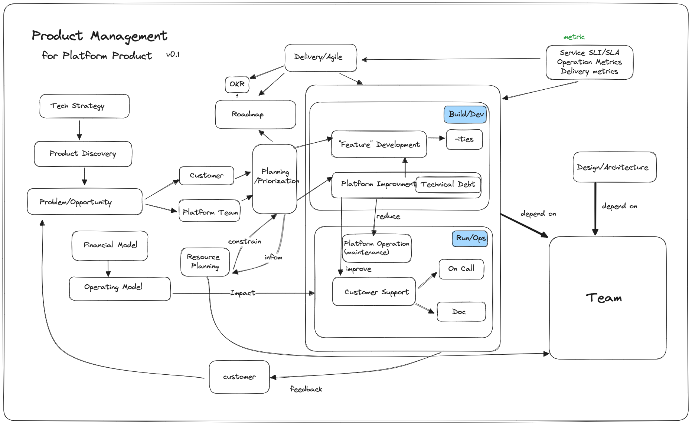

# Platform Product Management

Over the past few years, I have built and scaled several internal Platform Products within a large financial organization.

I aim to summarize the lessons I've learned and the mental model I've employed. This model is provisional and derived from my limited knowledge and experience. I will also recommend a few great books to help you develop your own model.

So, here you go:

I won't delve into details for all the aspects mentioned in the diagram, but I'll touch on a few topics in this post that I hope will be useful.

## Product Management as a discipline 

If there is only one book about Product Management I will recommend, it is [Inspired](https://www.amazon.com.au/INSPIRED-Create-Tech-Products-Customers-ebook/dp/B077NRB36N) from Marty Cagan.

Be skeptical of anyone who claims Product Management expertise but hasn't read this book, in the same way that you won't 
trust anyone is an expert C programmer but hasn't read [C Programming Language](https://www.amazon.com.au/Programming-Language-Brian-W-Kernighan/dp/0131103628).

## Platform Engineering as the new buzzword

Recently, *Platform Engineering* or *Internal Developer Platform* has been gaining popularity or even becoming the new buzzword. However, the best definition of a platform is succinctly summarized by Evan Bottcher in his 2018 article titled [What I Talk About When I Talk About Platforms](https://martinfowler.com/articles/talk-about-platforms.html)

> A digital platform is a foundation of self-service APIs, tools, services, knowledge and support which are arranged as a compelling internal product. Autonomous delivery teams can make use of the platform to deliver product features at a higher pace, with reduced co-ordination.

If you want a more extensive and latest take on the Platform and Platform Engineering, I will recommend you to read [CNCF Platforms White Paper](https://tag-app-delivery.cncf.io/whitepapers/platforms)

If you want to know a bit more about Platform Team and how it works with and serves other teams. [Team Topologies] will be an excellent read.

## Two product phases: Discovery and Delivery

Most companies should already be following some form of Agile delivery practices. Activities like sprint planning and 
retrospectives are commonplace. The key distinction lies in how well these practices are executed, rather than whether they know what to do.

In comparison, Product Discovery practices are less prevalent and well-known. The best book on this topic I have read is [Continuous Discovery Habits](https://www.amazon.com/Continuous-Discovery-Habits-Discover-Products/dp/1736633309).

## Two needs: Customer and Platform Team

It almost become cliché that a company should be "customer-obsessed" thanks to Amazon. Many cringe when they hear Ford's famous quote: "It is also well-known that 'if you ask what customers want, they will ask for a faster horse.'" The point being, we should listen to customers but not blindly do exactly what they ask for. To identify *Customer Needs*, have a read of [chapter four of Lean Product Development](https://leanproductplaybook.com/)

The other need often overlooked is the need of the Platform Team:

- The Platform Team needs to improve operational excellence to reduce toil and enhance their satisfaction.
- The Platform Team needs to enhance system reliability to scale and move faster.

And only the Platform team itself knows these needs. We must allocate time for these activities to ensure long-term benefits. Therefore, consider treating your Platform Team as one of the key input sources for your roadmap.

## Purposeful resource allocations

Time and People are the constraints you have. Balance Customer need and Plaform Team need. Balance visible features and non-functional platform characteristics. 
Use the following percentage as a starting point. And use metrics (mentioned later) to inform the decision. 

- 25% Features Development
- 25% Platform Improvement (through automation and improving system design to build and/or improve non-function requirements) 
- 25% Platform Operations
- 25% Customer Support

In the flow Framework, it categorizes the tasks into [four types: Features, Defect, Risks, Debt](https://blog.planview.com/the-four-flow-items-as-explained-by-my-car/).
It doesn't matter *how* you categorize your tasks, and you should not aim to achieve full [MECE](https://en.wikipedia.org/wiki/MECE_principle) for the categorization. As shown
in the diagram above, one task may contribute to the improvement of another. The important thing is to consciously allocate time for tasks that are not as visible as feature development but are critical for long-term product and team health and growth.

## Features are not all you need

- Most visible. Most likely to appear in OKRs. But remember that it only constitutes 1/4 of your total time/resource allocation.
- For significant initiatives, you will need to plan ahead, sometimes one or more years in advance. Refer to the funding model/cycle and resource planning.
- Don't be afraid to say NO to your customer's feature request. Use [5 why](https://www.lean.org/lexicon-terms/5-whys/) to find out the unstated need.
- Limit customization for a particular customer. It will impact your ability to scale. Opinionated is a good word depending on the context it is being said.
- Developer Experience (DevEx) is important, but also one of the most challenging aspects to address.

## Scalability: from 1 to 100

Scalability refers to the team's ability to operate the platform at scale. It is the ultimate measure of the platform's success.

While creating a single electric vehicle is a breakthrough, true achievement lies in achieving mass production with profitability. 

Nowadays, with the abundance of open-source tools and projects, building an internal platform proof of concept is not that difficult. The thriving Kubernetes ecosystem makes it especially simpler than it was five years ago.

However, many internal platforms and teams have either failed or are struggling to scale from 1 to 100, preventing them from fulfilling the primary purpose of an internal platform: serving developers, projects, and business units at scale.

## Developer Experience

When considering customers, an internal platform caters to various personas, but the primary one is the developer.

- Developer Onboarding: Self-service, facilitated through API/PR, and enable self-approval whenever possible.
- Developer Community: Utilize support channels and chat, conduct workshops for product updates and feature demonstrations, and foster an internal community. Over time, this approach promotes fellow developers helping each other, reducing reliance on the platform team.
- Developer documentation plays a crucial role in promoting self-service and minimizing the need for direct interactions between customers and the Platform Team.

## Metrics: You can improve what you can't measure

- **Service Metrics** concern how well the service is running. We can use [SLI/SLO/SLA](https://cloud.google.com/blog/products/devops-sre/sre-fundamentals-slis-slas-and-slos) as popularized by the SRE practice. 
- **Operation Metrics** concern how well the team is operating the platform. We can use [DORA metrics](https://cloud.google.com/blog/products/devops-sre/using-the-four-keys-to-measure-your-devops-performance) For example, your deployment failure rate is an indication of the platform reliability.  
- **Delivery Metrics** concern how well the team is delivering value. [Velocity](https://www.scruminc.com/velocity/) and typical Scrum stuff. However, it is never easy to get accurate and useful data. Requires lots of discipline and effort. An automatic delivery metrics instrumentation and aggregation will be a game-changer for organization delivery and process optimization.
- **Customer Metrics** concern how well the team is serving the customers. Examples are SLI/SLA for customer PR approval, ticket triage time, new feature release leading time, new environment setup leading time, etc. Last but not least, [Net Promoter Score](https://en.wikipedia.org/wiki/Net_promoter_score)

[team topologies]: https://www.amazon.com.au/Team-Topologies-Organizing-Business-Technology/dp/1942788819
[cncf]: https://landscape.cncf.io/
[conway]: https://en.wikipedia.org/wiki/Conway%27s_law
[Elon]: https://www.amazon.com.au/Elon-Musk-Walter-Isaacson/dp/1761422618

